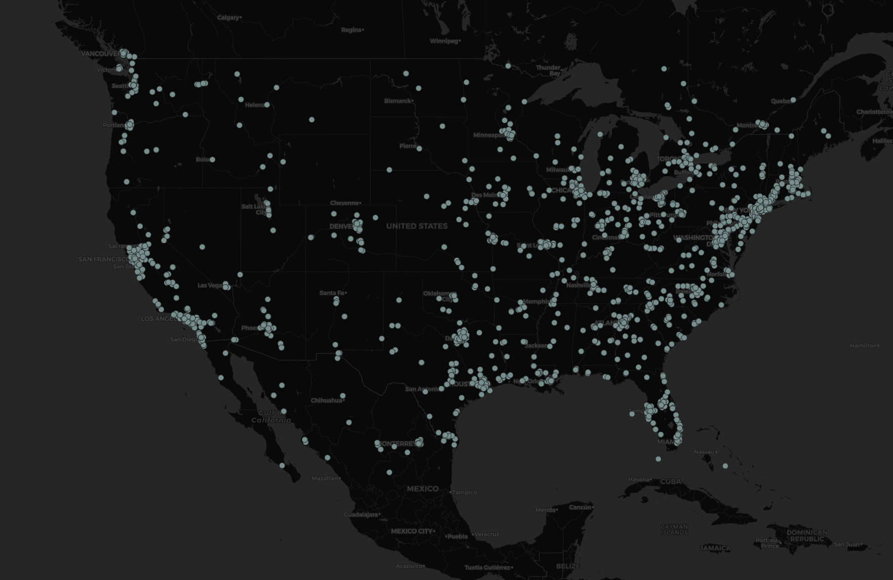

## A Look at Wall Street Tweets Across the U.S.
###### by Tim Roach

The above map displays the map that I generated while working through Lab 2. Since talk of stocks has dramatically increased over the past few days, I thought it would be interesting to look at data regarding this phenomenon. In order to see how these tweets were distributed across the United States, I filtered for the phrase "wall street" while scraping for tweets over a 60 second period on 1/29/2021. The points plotted on the above map represent the collected tweets that related to "wall street", and where they originated.

Basen on this map, it appears that talk of wall street is most prevelant in the eastern part of the United States. In the northeast near New York, we can see a pretty significant cluster of tweets. This is not necessarily surprising, as much of the financial industry (not to mention Wall Street itself) is located in New York. We also see a pretty significant distribution of tweets throughout the rest of the eastern United States, with a significant drop off in tweets west of the Dakotas. This is also not particularly surprising as the mountain zone of the U.S. has a lower population density than the east, and has less urban areas. Since tweets may be more likely to occur in urban places with more people, it seems reasonable that regions with less people would have fewer tweets; however, there is also the chance that there may be less interest in the stock market at this moment in this part of the country, or that people may generally not be as interested in using twitter in this region. Additionally, there appears to be a significant number of wall street related tweets on the west coast, particularly in California and Washington.

Since talk of Wall Street is popular right now, it appears that people are tweeting about it all over the country at the moment. It would be interesting to see what this distribution would be like at a time in which it is less popular to talk about. This would be an interesting thing to keep track of over the next month to see if there are any significant changes, as this would help us see where the term most often comes up in tweets.
